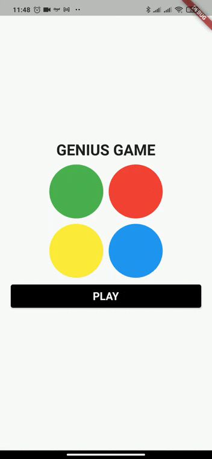

# Genius Game

  

Uma releitura do clásico **Genius Game** feita em Flutter.

# :rocket: Tecnologias utilizadas
Nesse projeto foram utilizadas as seguintes tecnologias:

* [Flutter Provider](https://pub.dev/packages/provider) - Para gerência de stado
* [Animations](https://flutter.dev/docs/development/ui/animations)
* [sqflite](https://pub.dev/packages/sqflite) - Para utilizar os recursos do banco de dados relacional SQLite

## Getting Started

This project is a starting point for a Flutter application.

A few resources to get you started if this is your first Flutter project:

- [Lab: Write your first Flutter app](https://flutter.dev/docs/get-started/codelab)
- [Cookbook: Useful Flutter samples](https://flutter.dev/docs/cookbook)

For help getting started with Flutter, view our
[online documentation](https://flutter.dev/docs), which offers tutorials,
samples, guidance on mobile development, and a full API reference.
